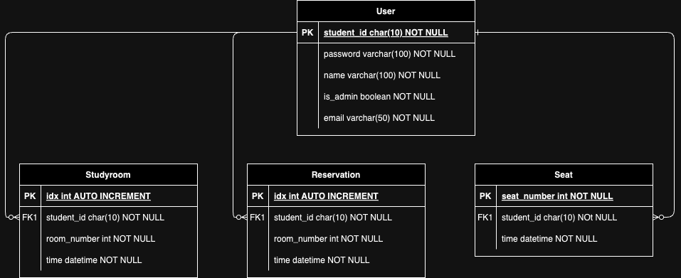

# Backend Directory
This directory is for backend.

## 데이터베이스 생성 및 연결


현재 **database서버**는 로컬에서 만들어서 돌리고 있습니다. test시에는 각자 로컬에서 MySQL 서버 실행 후 접속 바랍니다. 데이터베이스 연결 로직은 **database.py**와 **db_config.py**를 참고해 주시면 됩니다. (**db_config**는 **.gitignore** 되기 때문에 직접 만들어야 할 수도 있음 ==> 데이터베이스 생성 시, E-R Diagram 참고하면서 만들 것!)


### 데이터베이스 MySQL 이용하여 로컬에서 DB 생성 후 서버열기

먼저 자신의 컴퓨터에 MySQL이 설치되어 있는지 확인합니다. 각자 사용하는 운영체제 환경(Windows, Mac, Linux)에 따라 설치 방법이 다소 다를 수 있음. 이 설치 방법은 MacBook Pro M3를 기반으로 작성함을 밝힘.

- Mac OS
```bash
brew install mysql
```

- Linux(Ubuntu)
```bash
sudo apt update
sudo apt install mysql-server
```
설치가 완료되면 MySQL서버를 시작합니다
- Mac OS
```bash
brew services start mysql
```

- Linux(Ubuntu)
```bash
sudo systemctl start mysql
```

서버가 정상적으로 실행되면 ```mysql``` 명령어를 통해 로컬에서 접속할 수 있습니다. 이 때 ```mysql```이라는 명령어를 찾을 수 없다고 뜬다면, 환경변수에 mysql을 추가해주록 합니다.

```bash
mysql -u root -p
```

여기서 ```-u root```는 root 계정으로 접속을 의미하고 ```-p```는 비밀번호 입력을 요구합니다. MySQL 설치 중 설정한 비밀번호를 입력하시면 됩니다.
MySQL은 기본적으로 **포트 3306번**에서 실행됩니다.

이제 데이터베이스 생성 및 데이터 삽입에 대해서 말씀드리겠습니다.
```mysql```명령어를 통해 로컬에서 접속을 했다면, 터미널이 하나 뜰텐데 거기다가 아래와 같이 입력합니다. 이 때 모든 테이블을 한번에 만드려고 하지말고, 반드시 User 테이블부터 하나씩 순서대로 만드시길 바랍니다. 외래키 참조 때문에 그런 것이니 이해해 주시길 바랍니다.



```sql
-- User 테이블 생성
CREATE TABLE User (
    student_id CHAR(10) NOT NULL,
    password VARCHAR(100) NOT NULL,
    name VARCHAR(100) NOT NULL,
    is_admin BOOLEAN NOT NULL,
    email VARCHAR(50) NOT NULL,
    PRIMARY KEY (student_id)
);

-- Studyroom 테이블 생성
CREATE TABLE Studyroom (
    idx INT AUTO_INCREMENT,
    student_id CHAR(10) NOT NULL,
    room_number INT NOT NULL,
    time DATETIME NOT NULL,
    PRIMARY KEY (idx),
    FOREIGN KEY (student_id) REFERENCES User(student_id)
);

-- Reservation 테이블 생성
CREATE TABLE Reservation (
    idx INT AUTO_INCREMENT,
    student_id CHAR(10) NOT NULL,
    room_number INT NOT NULL,
    time DATETIME NOT NULL,
    PRIMARY KEY (idx),
    FOREIGN KEY (student_id) REFERENCES User(student_id)
);

-- Seat 테이블 생성
CREATE TABLE Seat (
    seat_number INT NOT NULL,
    student_id CHAR(10) NOT NULL,
    time DATETIME NOT NULL,
    PRIMARY KEY (seat_number),
    FOREIGN KEY (student_id) REFERENCES User(student_id)
);
```

이후 데이터 삽입은 INSERT문 을 사용할 필요 없이, Frontend에서 구현한 기능과 Backend에서의 라우터를 이용하여 데이터 삽입해주시면 됩니다. 

**절대로 INSERT문 과 같은 직접적인 sql문으로 데이터베이스에 데이터를 넣어주시지 말기 바랍니다!!**

## 필요한 pip 패키지 설치

```linux
pip install -r requirements.txt
```

## 서버 돌리기

Backend 서버를 돌리려면 backend 디렉토리로 들어 간 후 다음 명령어를 입력합니다.

```linux
uvicorn app.main:app --reload --host 0.0.0.0 --port 8000
```

이때 명령어의 뜻은 다음과 같습니다.
main.py 안에 있는 app 모듈을 실행한다.

```--reload``` : 자동으로 재로딩 되게한다(코드 수정하고 저장 시 자동으로 서버 리부트가 됨)

```--host 0.0.0.0``` : 모든 호스트들을 접속할 수 있게 한다

```--port 8000``` : 포트번호를 8000번으로 지정한다
